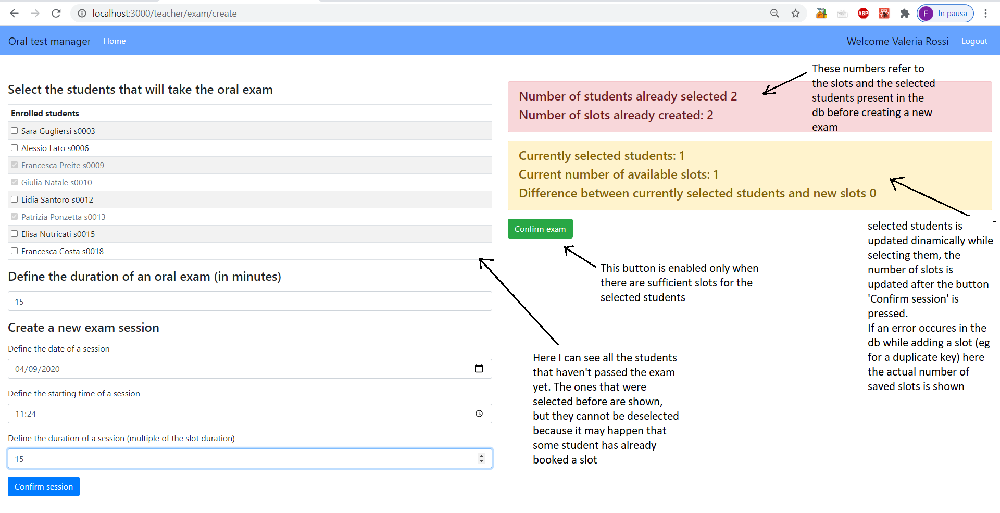

# Exam Web Application I: 10/09/2020
## Student: s276535 PONZETTA FRANCESCA

## React client application routes

- Route `/`: Home containing two buttons that allow the student or the teacher to access to their pages
- Route `/teacher/login` : Login form for the teacher (requested email and password)
- Route `/teacher/home`: Page containing the buttons for the  three actions that the teacher can do
    - Route `/teacher/exam/create` : Contains the form to create a new exam (with the possibility of adding multiple sessions)
    - Route `/teacher/exam/results` : Contains a table with the list of selected students with their booking, result of the exam and exam state (not taken/passed/fail/withdrawn/absent)
    - Route `/teacher/exam/execute`: Contains a table with the students that have to be examined with an optional form that allows to set the exam result for the choosen student
    and another table with all the other slots defined fot this exam (the ones where nobody has booked yet)

- Route `/student/login`: Login form for the student (requested studentId)
- Route `/student/home` : Contains two tables: one with the exam booked by the student, the other with the courses where the student can book the exam. If the student select the exam, an optional form is shown where he can choose the slot to book and a confirm button to save the booking.

## REST API server

  API functions for the student
- POST `/api/student/login`
  - request body contains the studentId of the student
  - if the studentId is present in the db, the response contains a successfull message and the student can access to the following pages

- GET `/api/student/home/bookings`
  - the studentId is retrieved from the query parameters
  - the response contains a list of all the current bookings for that student

- GET `/api/student/home/courses`
  - the studentId is retrieved from the query parameters
  - the response contains a list of all the courses where the sudent can book

- GET `/api/student/home/slots`
  - the courseId is retrieved from the query parameters
  - the response contains a list of all the slots not already booked for that course

- PUT `/api/student/home/deletebooking`
  - the courseId, the booking and the studenId are retrieved from the query parameters
  - the booking is deleted from the enrolled table and the studentId is deleted from the slots table. If the delete is successfull, the response contains a successful message 

- PUT `/api/student/home/savebooking`
  - the courseId, the date and time of the slot and the studenId are retrieved from the query parameters
  - the booking is saved in the enrolled table and the studentId is saved in the slots table. If the update is successfull, the response contains a successful message 

API functions for the teacher

- POST `/api/teacher/login`
  - request body contains email and password of the teacher
  - if the credentials are valid, the response contains the info about the authenticated teacher (teacherId,name,surname, courseId,email,courseDescription) plus the generated JWT token in the header

- POST `/api/teacher/logout`
  - request contains the cookie in the header to be cleared
  - no response

  From now on all API requires a valid JWT in the request header

- GET `/api/teacher`
  - the request contains a token in the header
  - if the token is valid, the response contains the info about the authenticated teacher (teacherId,name,surname, courseId,email,courseDescription)

- GET `/api/teacher/exam/create/students`
  - the courseId is retreived from the request header
  - if the teacher is authenticated, the response contains the list of all the students enrolled in the course that haven't passed the exam yet

- PUT `/teacher/exam/create/select`
  - the courseId is retreived from the request header, the request body contains the studentId and the selected value 
  - if the teacher is authenticated, the selected field for this student will be updated with the new value of selected. No response

- POST `/teacher/exam/create/newsession`
 - the courseId is retrieved from the request header, the request body contains the date and the start time of the session
 - if the teacher is authenticated, a new slot is created in the db. No response (if the slot is not added in the db, for example because another slot of the same course with the same date and starting time is present, an error message is shown).

- GET `/teacher/exam/create/current-slots`
  - the courseId is retrieved from the request header
  - if the teacher is authenticated, the response contains the list of available slots (not booked) for this course

- GET `/teacher/exam/execute/bookedstudents`
  - the courseId is retrieved from the request header
  - if the teacher is authenticated, the response contains a list with the details of a student (id, name, surname, booking, result and examState)

- GET `/teacher/exam/exam/results`
  - the courseId is retrieved from the request header
  - if the teacher is authenticated, the response contains the list of selected students (with their details of booking, result and exam state)

- PUT `/teacher/exam/execute/set-result`
  - the courseId is retrieved from the request header. The request body contains the studentId of the examined student and his result
  - if the teacher is authenticated, the enrolled table is updated by setting the result and the exam state of the examined student. No response

## Server database

- Table `teachers` - contains teacherId, name, surname, courseId, email, hash, courseDescription (primary key = teacherId)
- Table `students` - contains studentId, name, surname (primary key = studentId)
- Table `enrolled` -contains courseId, studentId, selected, booking, result, examState (primary key= courseId, studentId)
- Table `slots` -contains courseId, dateAndTime, studentId (primary key = courseId,dateAndTime)

## Main React Components

- `Header` (in `components/Header.js`): component always present, contains the name of the application, the Home button, the name of the authenticated user (if present) and the logout button (if the authenticated user is present)
- `StudentAccessForm` (in `component/StudentAccessForm.js`): simple login form that requires the student ID
- `TeacherLoginForm` (in `component/TeacherLoginForm.js`): login form that requires an email and a password
- `StudentHome` (in `component/StudentHome.js`): student home page, it contains two tables (`CurrentBookings`, which shows a list with all the bookings of the student and the result of the taken exams, and `AvailableCourses`, which shows a list with all the courses where the student can book the oral exam)
  - `BookingSlotsForm` (in `components/BookingSlotsForm.js`) is an optional form that is shown in `StudentHome` when the student selects a course. This form shows a list of all the available slots that can be booked.
- `CreateExam` (in `components/createExam/CreateExam.js`) contains the form that allows the teacher to define a new exam:
  - `SelectStudents` (in `components/createExam/SelectStudents.js`) show the list of students that have not passed the exam yet. The ones that have already been selected cannot be deselected (because some selected student may already have booked the slot without having taken the exam). Here there is a box that shows the number of selected students and the number of slots previously saved in the db. Another box shows the number of currently selected students and the number of new slots created (dinamically).
  - `SlotForm`(in `components/createExam/SlotForm.js`) contains the form component that allows to save the duration of a single slot
  - `CreateSession` in `components/createExam/CreateSession.js` is shown only when the 'Add Session' button is clicked. It allows to insert the date and start time of a session and the duration of a session.
  - The button 'Confirm Exam' is enambled only when there are sufficent new slots for the new selected students.

- `ExecuteExam` (in `components/ExecuteExam.js`) contains a table with the booked slots and the info about the booked student, together with an 'edit button'. When the button is pressed, an optional form (`ResultExamForm` in `components/ResultExamForm.js`) is shown, where the teacher can set the exam state or the mark of the exam. It contains also a table with all the slots created by the teacher not already booked.
- `TeacherViewResults` (in `components/TeacherViewResults.js`) contains a table with the list of all the selected students (if they have already passed the exam, the result is shown, or if they have already booked, the booking is shown).

## Screenshot

## Test users
TEACHERS
* email: t0001@polito.it, password: password1
* email: t0002@polito.it, password: password2

STUDENTS
* studentId : s0001
* studentId : s0002
* studentId : s0003
* studentId : s0005
* studentId : s0006
* studentId : s0009
* studentId : s0010
* studentId : s0019

